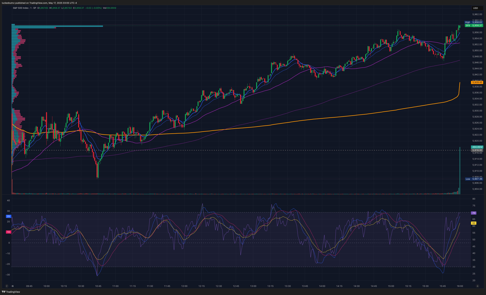
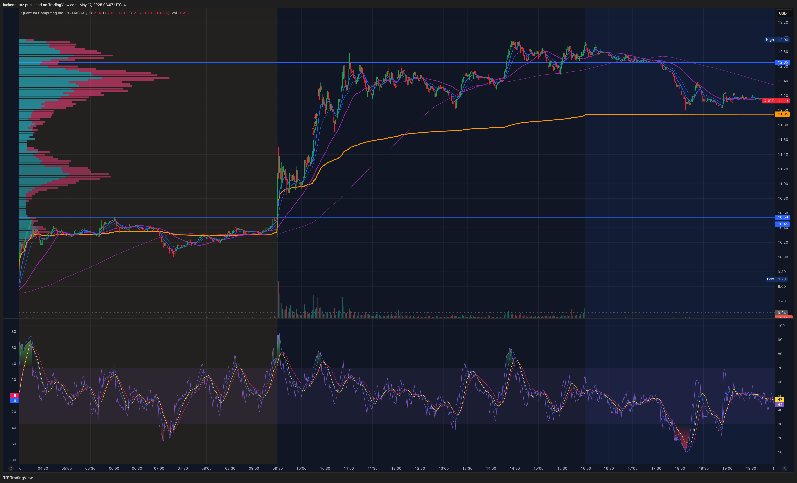
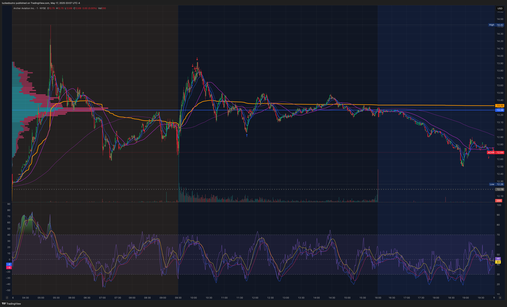
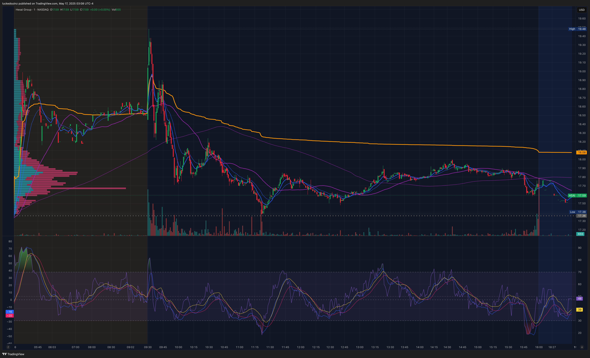
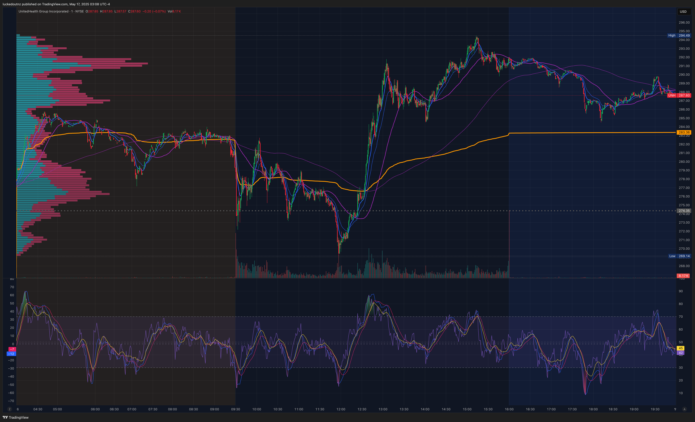
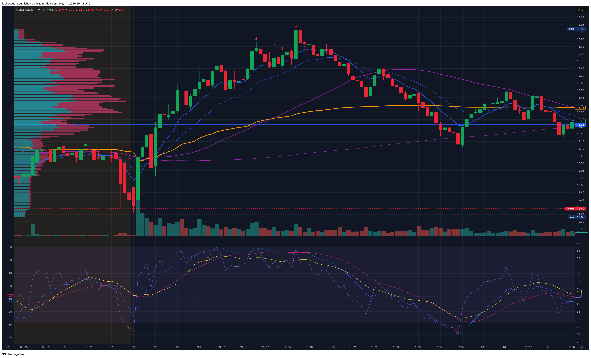
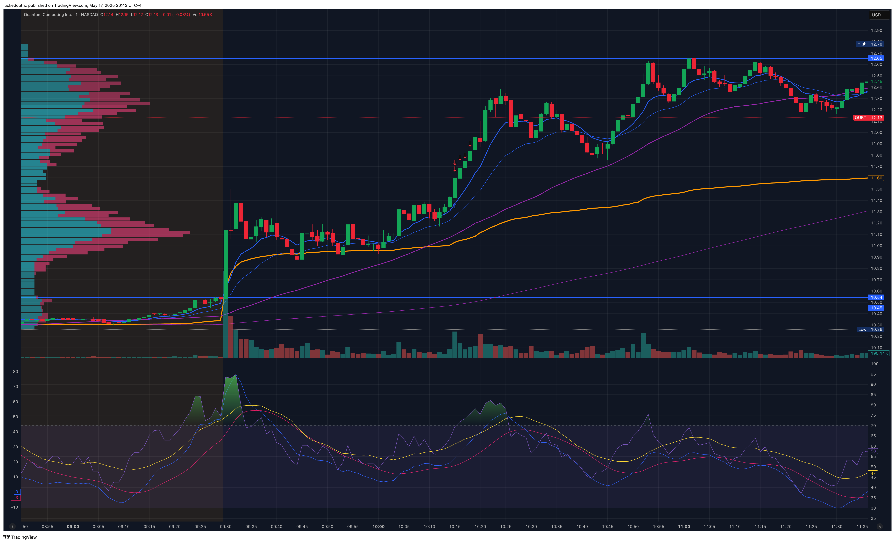
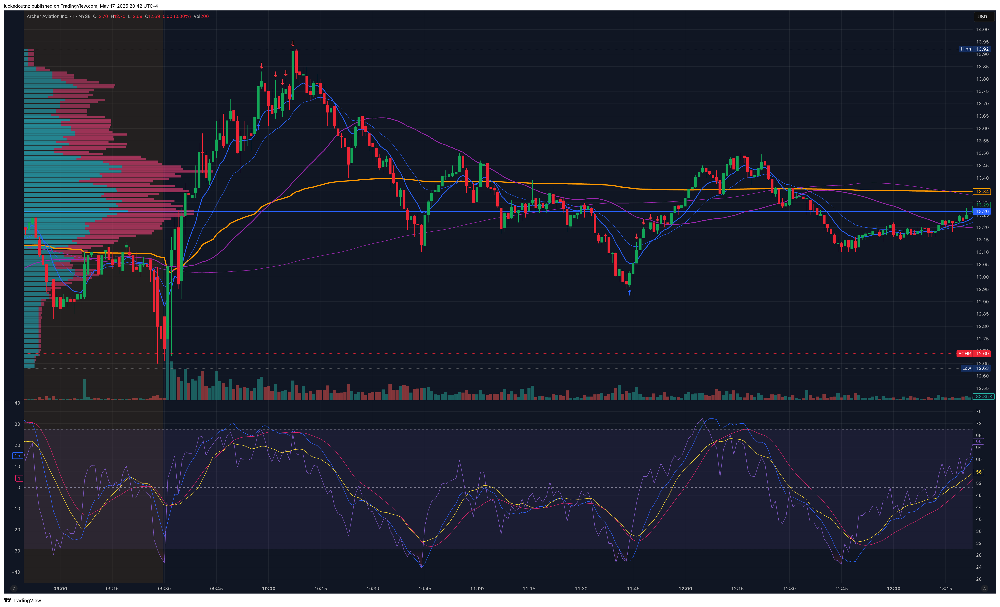

# 17 May 2025 — Day 5

Date in US: 16 May 2025

## News & Summary

S&P futures up 20 points (0.34%).
Import/export price index grew 0.10%, forecast was -0.40%/-0.50%.

- [BearBullTraders Premarket Show](https://www.youtube.com/watch?v=yM4TcxpFy8E)

## Selected Tickers

### QUBT

Identified from:

- Bear Bull Traders premarket show,
- ZenBot Gap Up & Open scanner.

| Key              | Value        |
|------------------|--------------|
| Float            | 112.7M (80%) |
| Market Cap       | $1.5B        |
| ATR (1D)         | $0.68        |
| Avg. Volume (1D) | 17.0M        |

### ACHR

Identified from:

- Identified from Bear Bull Traders premarket show 
- ZenBot Gap Up & Open scanner.

| Key              | Value  |
|------------------|--------|
| Float            | 412M   |
| Market Cap       | $6.69B |
| ATR (1D)         | $0.74  |
| Avg. Volume (1D) | 25.0M  |

### HSAI

Identified from:

- ZenBot Gap Up & Open scanner.

Poor price action.

| Key              | Value  |
|------------------|--------|
| Float            | 75.2M  |
| Market Cap       | $2.28B |
| ATR (1D)         | $1.45B |
| Avg. Volume (1D) | 6.0M   |

### UNH

Identified from:

- ZenBot Gap Up & Open scanner, 
- Bear Bull Traders premarket show, 
- Past two days of downward price action.

| Key              | Value   |
|------------------|---------|
| Float            | 905M    |
| Market Cap       | $248.9B |
| ATR (1D)         | $18.32  |
| Avg. Volume (1D) | 15.7M   |

## Trades

### ACHR Long (Trade #1)

Watching ACHR breakout on open, I noticed some consolidation in the price action that made me optimistic there could be another breakout in a bullflag momemtum strategy. Entered on confirmation of volume and strong green candle. Stop loss was beneath the previous few minutes of support.

Given my thesis was correct, I could have been less aggressive taking profit when the candles dipped, and instead taken profit at highs. Maximum theoretical take profit on the trade was $13.92.

Entries:
- 100 long @ $13.66

Exits:
* 20 @ $13.78
* 20 @ $13.74
* 20 @ $13.72
* 20 @ $13.77
* 20 @ $13.80

P&L:

### QUBT Long (Trade #2)

Opening Range Breakout trade about 45 minutes after open. QUBT had consolidated around the $11.30 mark for the past several minutes after a bullish pop, after having previously bounced off VWAP three times since opening.

Entered on 3 minutes of bullish candles with volume confirmation. Stop loss was VWAP. Took profit five times while riding the momentum uphill. Again—similar to the first trade—I was too aggressive in taking profit at lows on candles. 

Maximum theoretical TP/share was $12.38. Possibly my best trade of the day, but could have been extended by not being so scared of taking a loss.

Entries:
* 100 long @ $11.45

Exits:
* 20 @ $11.56
* 20 @ $11.58
* 20 @ $11.66
* 20 @ $11.71
* 20 @ $11.79

P&L:

Commission:

### ACHR Long (Trade #3)

Bottom-reversal trade—was watching ACHR make new lows on nearly every candle, with RSI dipping to 26. An indecision candle formed, followed by higher volume bullish candles indicating a reversal. First take profit was arguably too early as significant momentum was present and candles were accelerating away from the EMAs. 

Later take profits were likely too early despite a reduction in price increase. Maximum theoretical TP/share was $13.45. Having four partial TPs resulted in less commission costs too.

Entries:
* 100 long @ $13.02

Exits:
- 25 @ $13.12
- 25 @ $13.16
- 25 @ $13.19
- 25 @ $13.17

P&L:

Commission:

## What went right?

- Watching BearBull Traders Premarket livestream is an excellent way to ground myself relative to professionals.
- Some of the tickers they identified were ones I either identified on previous days, or were on my ZenBot scanner.
- Three excellent trades that were all profitable.

## What went wrong?

- When in momentum, I should try and take profit less aggressively—my gains were capped in all three trades by selling early, ride the momentum.

## What improvements can I make?

- [ ] Learn about pivot-point systems, S3, S4 etc.
- [ ] Switch to TWS and hotkeys for trading.
- [ ] Consider taking profit less frequently and letting winners run.
- [ ] Prefer ½ and ¼ take profits instead of smaller sizes to reduce commission.

## What did I learn?

- Selling partials as a risk buydown strategy felt emotionally relieving—although this generates higher commissions, taking profit partially makes me more willing to let winners run longer.
