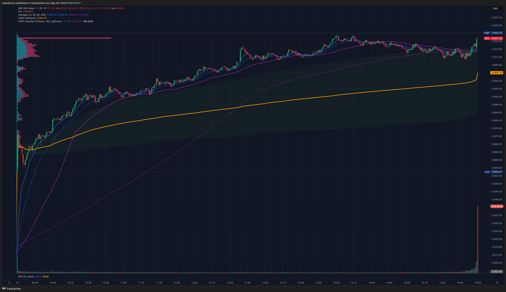
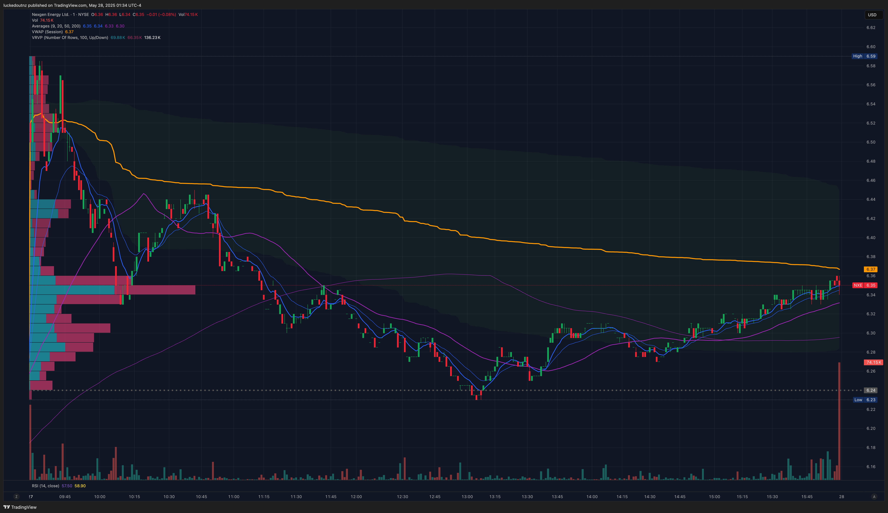
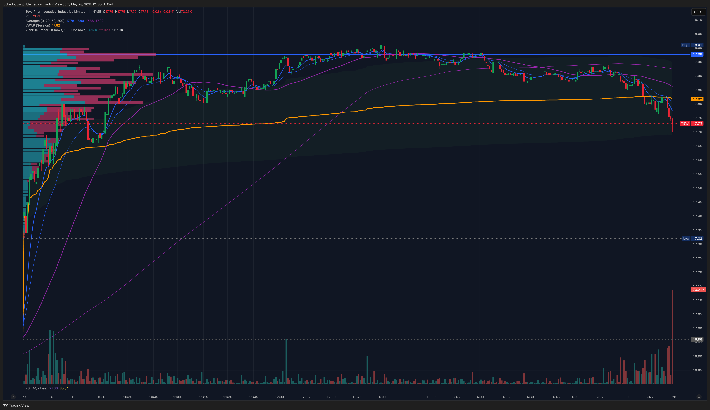
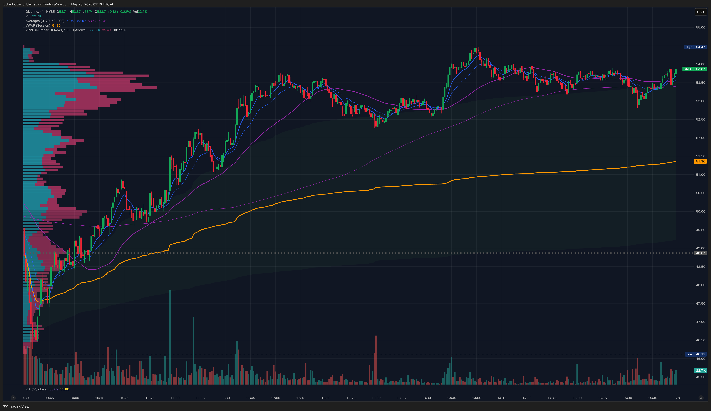

# 28 May 2025 — Day 11

Date in US: 27 May 2025

## News & Summary

ES=F futures up 1.44% as of 1 hour before end of premarket as [Trump signalled a EU tariff reprieve](https://finance.yahoo.com/news/live/stock-market-today-dow-sp-500-nasdaq-futures-soar-as-trump-pauses-eu-tariff-hikes-for-fast-tracked-talks-000114425.html), intending to push back 50% tariffs to a later date. [Consumer confidence](https://www.conference-board.org/topics/consumer-confidence) increased by 12.3 points to 98.0 from 85.7 in April.

- [Bear Bull Traders Premarket Show](https://www.youtube.com/watch?v=cv4T8JnPiUs)

## Selected Tickers

### NXE

#### How did I find this stock?

I found this in the ZenBot High RVol scanner, [on news that they may have discovered high Uranium Oxide concentrations in a drilling site](https://finance.yahoo.com/news/nexgen-announces-best-assays-patterson-103000883.html). The stock ultimately ended up not being in play and had too little volume and range to be day tradable.

#### Why am I trading it?

The fundamental catalyst of this stock was based on news unique to them, not necessarily the nuclear industry. Given SPY was looking like it may lead to a green day, I felt it was possible this stock would be stronger than the market. My concern was that the ATR at $0.28 was too low to generate the price action needed to make money—this was proven to be accurate.

#### How will I trade it?

Added three resistance levels on the daily chart at $7.70, $8.45, and $8.96; along with a support at $5.19. Although it didd not have a high ATR, I thought it could be plausible as a momentum play that followed the 9 EMA that set up to the long side and held.

If I noticed the stock try and respect the 9 EMA above VWAP, I would enter long—ideally after a consolidation period where my low was slightly beneath the 9EMA line.

Alternatively, if it sold off, to well below VWAP, and an indecision candle forms after a period of consistent downward movement, I would have entered long on confirmation on next higher candle—with stop loss being the low of the indecision candle—for a reversal trade.

#### Statistics

| Key            | Value | Classification        | Source         |
| -------------- | ----- | --------------------- | -------------- |
| Market Cap.    | $3.6B |                       | ZenBot Scanner |
| Float          | 520M  |                       | ZenBot Scanner |
| Avg. Volume    | 9.7M  |                       | ZenBot Scanner |
| ATR (14 days)  | $0.28 |                       | ZenBot Scanner |
| Short Interest | 14.5% | Of shares outstanding | Yahoo Finance  |

### TEVA

#### How did I find this stock?

Found from the ZenBot Gap Up Scanner, [on news that they had announced an initiative with Biolojic Design Ltd for an investigational new drug study (IND)](https://finance.yahoo.com/news/teva-biolojic-design-initiate-ind-123000611.html).

#### Why am I trading it?

With lower short interest than NXE, the historical price action appeared dynamic. The stock had gapped up in premarket, so I thought it could see a sell-off on open as premarket buyers take profits. This was incorrect and it instead continued to climb up to a high of $18.00.

#### How will I trade it?

I added a resistance at $17.98 (a good choice, as this was the high of the day) on some higher volume from the middle of May, as well as two supports at $16.59 and $16.14. I added three further levels at wider ranges at $22.43, $18.96, and $12.96.

I wanted to see confirmation of an opening range breakout or momentum before trading it to confirm an entry. The last two days of price action had seen upward trends that respected the 9 EMA very nicely. If no price action respected this, I probably wouldn't have participated. My stop loss would've been below the 9 EMA.
#### Statistics

| Key            | Value | Classification | Source         |
| -------------- | ----- | -------------- | -------------- |
| Market Cap.    | $20B  |                | ZenBot Scanner |
| Float          | 1B    |                | ZenBot Scanner |
| Avg. Volume    | 11.9M |                | ZenBot Scanner |
| ATR (14 days)  | $0.74 |                | ZenBot Scanner |
| Short Interest | 2.49% |                | Yahoo Finance  |

### OKLO

#### How did I find this stock?

I added this stock after finding there was not enough volatility and liquidity in NXE and TEVA, by searching through tickers I am familiar with, and knowing that it had been tradable the previous market day.

#### Why am I trading it?

Stocks in play can often be in play for several days after a catalyst, so given I successfully traded it on 24 May, I added it after observing the possibility for a continuation of the existing momentum trade to the upside that had taken place in the previous hour.

#### How will I trade it?

I did not mark support and resistance levels. My planned trade on viewing was to find an entry for a continuation of the 9 EMA momentum following the stock was showing, with my stop loss being a break of the 9 EMA or slightly lower.

#### Statistics

| Key            | Value  | Classification | Source                 |
| -------------- | ------ | -------------- | ---------------------- |
| Market Cap.    | $5.0B  |                | Statistics from 24 May |
| Float          | 101.2M |                | Statistics from 24 May |
| Avg. Volume    | 13.2M  |                | Statistics from 24 May |
| ATR (14 days)  | $3.66  |                | Statistics from 24 May |
| Short Interest | 10.88% |                | Yahoo Finance          |

## Trades

### TEVA Long (#1) — 1:44:52AM

Trade type: 9 EMA Momentum

This was my only trade of the planned stocks I had shortlisted this morning—I noted TEVA in the Zenbot Gap Up scanner. I actually missed a nice entry at 1:37AM where the stock dipped below VWAP and rejected. This would have made my entry $17.52 instead of $17.58.

My entry rationale was on a red candle that rejected off the 9 EMA, in a broader trend of upwards movement following the 9 EMA. My entry was in the lower half of the candle, exactly on the 9 EMA line, with a stop loss being perhaps at $17.50 beneath the VWAP, this made my overall risk 8c/share for $20 total risk.

My position sizing was for 250 shares totalling approximately $5000.

Again, I arguably took profit too early—this continues the pattern where I am wanting to protect my capital and not let trades run, rather than exiting on technical indicators (such as a reduction in momentum).

#### Environmental

I hadn't gotten as much sleep as I would've preferred prior to waking up to trade.

#### What went right about this trade?

- My technical analysis was accurate, and the stock bounced off the 9 EMA and continued to climb (albeit with some deceleration in the latter half), this also matched my premarket plan.

#### What was wrong about this trade?

- Missed an earlier entry at 1:37AM which arguably had better technicals.

### OKLO Long (#2) — 2:46:32AM

Trade type: 9 EMA Momentum

After recognising the stocks I had shortlisted were not in play, I paged through other stocks I had previously traded and identified OKLO as a good candidate for a momentum trade. 

After observing the stock pop and resoundingly shoot across the 9 EMA in an engulfing candle with lots of volume as an indication of buying pressure, I waited for a pullback and entered on the wick of the following candle, securing a relatively good entry at $50.25 on 50 shares. This was half my intended sizing (approximately $2500) as I was less confident about this trade because I hadn't prepared to trade OKLO this morning.

I sold early because I was tired, but definitely limited my gains by doing so.
#### Environmental

I was feeling tired, and primarily ended the trade out of wanting to get some sleep.

#### What went right about this trade?

- My entry and analysis was good—I aimed to find a low point in the pullback to enter after confirmation of volume in a green candle.

#### What was wrong about this trade?

- I lacked discipline in letting the trade run.

## What went right?

- I pivoted on the fly into a considered decision to trade OKLO—based off my past experience with the ticker—after my two shortlisted tickers lacked volume. This turned into my most successful trade of the day.

## What went wrong?

- My two shortlisted tickers had too small of a volume and too low of an ATR to provide profitable tradability. I should prefer stocks with higher volatility, even if they appear in the scanners.
- I missed a moment where TEVA bounced off VWAP and set up for a long at around 2:00AM because I wasn't paying attention at the time.
- I could have held OKLO much more aggressively and for longer.

## What improvements can I make?

- [ ] Add a minimum ATR requirement to any stock I shortlist, likely following Andrew Aziz's preference of at least $0.50.
- [ ] After the Bear Bull Traders premarket show closes, I often find myself feeling alone in terms of watching the market and getting a vibe check. I should make better use of the r/RealDayTrading Discord after the show ends.
- [ ] I should drink some water after waking up, and add that to my trading framework.
- [ ] Cross-check when in a trade against the 5 minute chart to provide perspective.

## What did I learn?

- Not every stock on a gapper watchlist is a stock in play. Even mid-cap stocks can lack sufficient volatility to be day tradable. 
