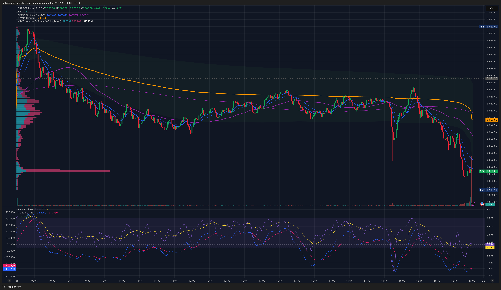
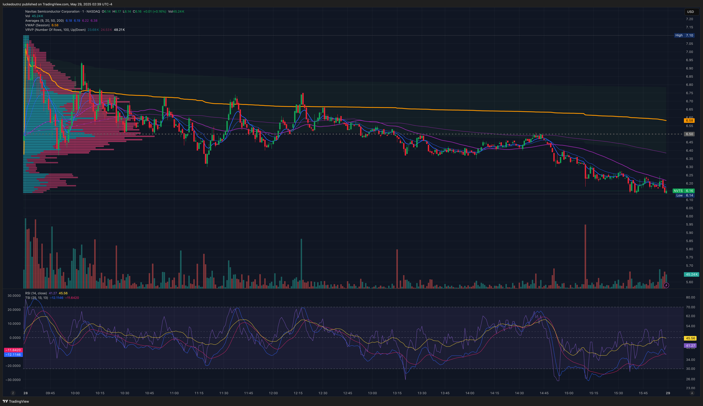
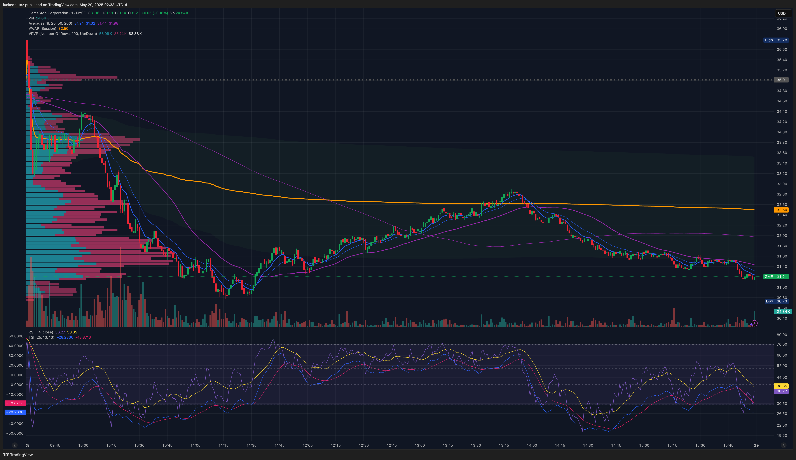

# 29 May 2025 — Day 12

Date in US: 28 May 2025

## News & Summary

- [Major U.S. futures flat whilst waiting for NVDA's earnings report](https://finance.yahoo.com/news/live/stock-market-today-dow-sp-500-nasdaq-futures-stall-with-all-eyes-on-nvidia-earnings-233141257.html).
- [Federal Open Market Committee (FOMC) May meeting minutes](https://www.federalreserve.gov/monetarypolicy/fomcminutes20250507.htm) released at 2PM. The markets usually move, and then retrace that move; but no such movement took place.
	- [Fed concerned about tariff-driven inflation risks: FOMC minutes](https://finance.yahoo.com/video/fed-concerned-tariff-driven-inflation-193045014.html)
- [Bear Bull Traders Premarket Show](https://www.youtube.com/watch?v=P-2RgHNX3_Y)

## Selected Tickers

Tickers I didn't select:

- **ANF**. They beat earnings, but have a small ATR, and the premarket price action was very stable.
- **JOBY**. Weak volume day before, but higher in premarket today with clear levels.
- **NVDA**. Upcoming earnings news.
- **OKLO**. Previous trade from yesterday.
- **OKTA**. Mentioned on Bear Bull Traders premarket show.
- **QBTS**. Mentioned on Bear Bull Traders premarket show.

### NVTS

#### How did I find this stock?

This was mentioned in the Bear Bull Traders premarket show, and also appeared in the "Strong Daily" scan on ZenBot. It had jumped on [being mentioned by Jim Cramer](https://finance.yahoo.com/news/jim-cramer-navitas-semiconductor-nvts-215240650.html) (a la the "inverse Cramer effect").

This stock did see high relative volume throughout the day, but was not in play for how I intended to trade the stock; instead it sold off throughout the day—with the occasional tests of VWAP—mostly staying below VWAP and the 20 EMA.

#### Why am I trading it?

The stock had a good run up the day before with a nice momentum trend respecting the 9 EMA; which made me confident it might have had good price action today too (which it did).

#### How will I trade it?

I added daily resistance at $10.75 and $8.42, with daily support at $4.91; and premarket resistance at $7.94. I intended to trade long if it set up for another gap up like the day before, especially if it bounced off VWAP or other technical levels.

#### Statistics

| Key            | Value  | Classification | Source        |
| -------------- | ------ | -------------- | ------------- |
| Market Cap.    | $1.4B  |                | ZenBot        |
| Float          | 117.3M |                | ZenBot        |
| Avg. Volume    | 17.1M  |                | ZenBot        |
| ATR (14 days)  | $0.62  |                | ZenBot        |
| Short Interest | 18.37% |                | Yahoo Finance |

### GME

#### How did I find this stock?

It was mentioned on the Bear Bull Traders premarket show and made it onto their primary watchlist. The stock was in play, just not in the direction I had planned.

#### Why am I trading it?

There were three fundamental catalysts that made this worth watching: 

1. GME's historical meme-stock potential.
2. An upcoming earnings report.
3. [The news they had purchased 4710 bitcoins](https://finance.yahoo.com/news/gamestop-corp-gme-slides-investors-004732215.html).

#### How will I trade it?

Daily resistance at $47.50, $34.40, daily support at $20.78. My original intention was planning on seeing GME continue to climb, and trading an opening range breakout or a momentum trade; but the stock sold off instead.

#### Statistics

| Key            | Value  | Classification | Source         |
| -------------- | ------ | -------------- | -------------- |
| Market Cap.    | $16.0B |                | ZenBot Scanner |
| Float          | 408.7M |                | ZenBot Scanner |
| Avg. Volume    | 13.0M  |                | ZenBot Scanner |
| ATR (14 days)  | $1.32  |                | ZenBot Scanner |
| Short Interest | 3.49%  |                | Yahoo Finance  |

## Trades

### GME Long (#1) — 1:43:39AM

Trade type: VWAP Breakout

At 1:42AM an engulfing green candle formed which broke through VWAP with large volume and resoundingly rejected a downward move. I waited for pullback on the next candle, and entered at a price of $33.90. Unfortunately, the price did not move upward after this and I was stopped out at $33.44—at my maximal amount of risk. I could have waited to see if the price action resisted VWAP for a bit longer before entering.

#### Environmental

I felt well rested, and based on my previous success with OKLO. I was eager to get into a trade, and possibly this made me feel more trigger-happy than I could have been, not wanting to miss a breakout.

#### What went right about this trade?

Nothing recorded.

#### What was wrong about this trade?

My two confirmations were a rejection of break below VWAP, and high volume on that candle. These are not bad on their own, but combined with my eagerness this probably led me to taking a trade that could have been avoided by watching the price action further.

### GME Long (#2) — 2:01:31AM

Trade type: VWAP breakout & Bull Flag Momentum

After a clear engulfing candle with volume that crossed VWAP followed by two more upward candles that also caused a 9-20 EMA cross, I entered long with 50 shares at $34.30 in what I believed to be a consolidation candle after a bull flag.

Unfortunately this was a beginning of an extended short run down for several hours, so I cut my losses when the price action crossed VWAP again.

#### Environmental

Quite keen to record a positive trade.

#### What went right about this trade?

From a technical analysis standpoint I think the volume of the engulfing candle crossing VWAP, combined with the 9 EMA crossing the 20 EMA, and a brief upward climb made for an acceptable entry, but unfortunately, no momentum was created from this trade.

#### What was wrong about this trade?

This trade was not as terrible as the first, with more signal confirmation, but it was not followed with upward price action.

## What went right?

- I had a better amount of sleep beforehand.
- I did not try and revenge-trade after my two loss-making trades.

## What went wrong?

- Feeling dejected by two loss-making trades on GME.
- I didn't consider if I should have reduced my size for the second GME trade after the first did not go in my favour.

## What improvements can I make?

- [ ] Learn about how to take shorts, and configure TWS to have a hotkey for that.
- [ ] Do more research into _when_ to enter momentum breakouts. Do I wait for confirmation of breakout when it often feels over-extended, or do I enter earlier when it feels I'm risking too much without certainty?
- [ ] Before entering a trade, audibly determine two things:
	- [ ] The strategy I am entering.
	- [ ] How I will size my entry.

## What did I learn?

My big takeaway from today was reflecting on Andrew Aziz's comments around ignoring your profitability when you begin your journey. Although it is disappointing to record a 0% success rate day, especially with losses close to my maximum risk, from a statistical point of view, this is the beginning of a journey and as long as overall the trend is upwards in the next few months, that is all that matters.
